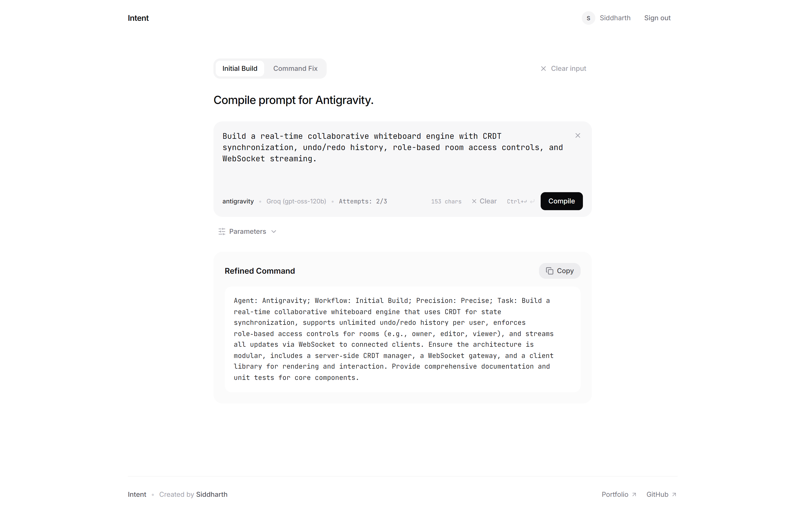
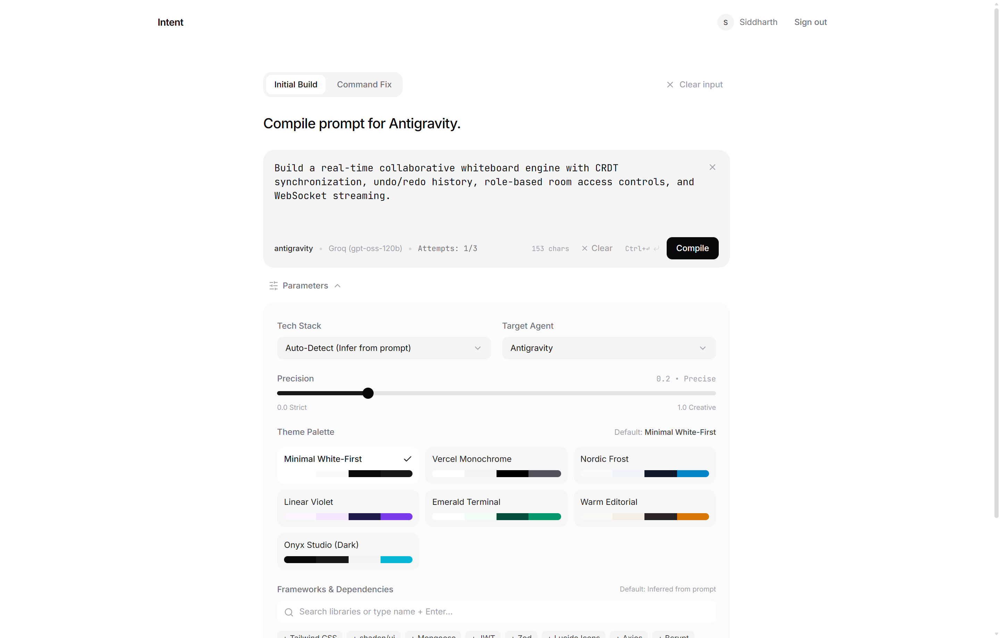
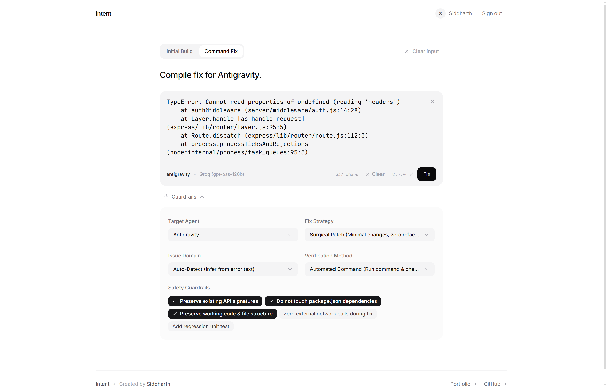
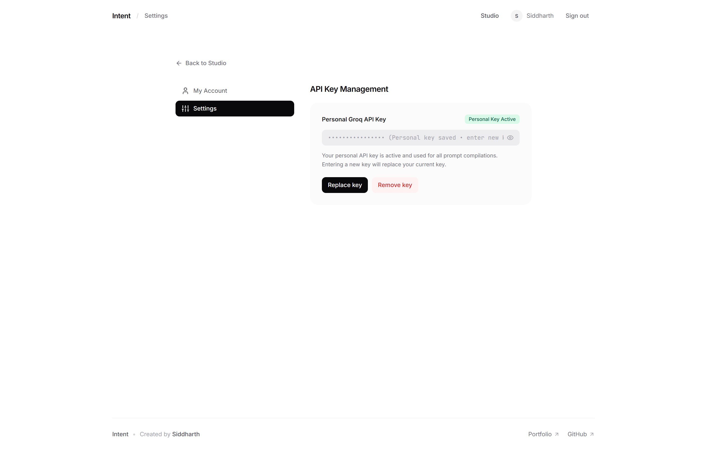
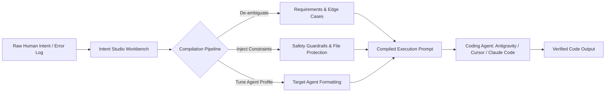

# Intent Studio — AI Intent Compiler

[](https://intent-tau.vercel.app)
[](https://siddharthn-portfolio.vercel.app/)
[](https://github.com)
[](https://groq.com)
[](https://nodejs.org/api/crypto.html)
[](LICENSE)

> A specialized developer workbench that translates ambiguous human instructions, raw specifications, and terminal errors into structured, high-precision execution prompts for autonomous AI coding agents (Antigravity, Cursor, Claude Code, and Codex).

<p align="center">
  
</p>

---

## Overview

Autonomous coding agents are transforming software engineering, but their real-world output depends entirely on the clarity and constraints of the initial prompt. 

When developers pass informal, high-level thoughts directly to an autonomous agent—such as *"fix user authentication"* or *"add file uploads"*—agents often:
* **Over-refactor**: Modify unrelated files, rewrite working utilities, or alter existing public API contracts.
* **Break Dependencies**: Introduce conflicting npm/pip packages or upgrade dependencies unnecessarily.
* **Hallucinate Architecture**: Make arbitrary assumptions about directory structures, styling patterns, and state management.
* **Get Caught in Circular Loops**: Drift into repetitive edits when resolving ambiguous terminal errors.

**Intent Studio** solves this steering problem. It acts as an **Intent Compilation Layer** between the developer and the autonomous coding agent, transforming raw human intent into verified, constraint-bound execution tasks.

---

## Interface & Key Screens

### 1. Initial Build Workbench
*Translates ambiguous feature prompts into structured execution directives with intelligent tech stack detection, design palettes, and curated library guardrails.*

<p align="center">
  
</p>

### 2. High-Precision Compiled Output
*Outputs pure, zero-fluff execution contracts tailored to the target coding agent (Antigravity, Cursor, Claude Code) with one-click copy.*

<p align="center">
  
</p>

### 3. Command Fix Mode (Surgical Error Patching)
*Scopes terminal errors and stack traces to exact architectural boundaries, applying surgical patch strategies and strict safety guardrails.*

<p align="center">
  
</p>

### 4. BYOK Security & API Key Management
*Bring-Your-Own-Key infrastructure featuring military-grade AES-256-GCM authenticated encryption at rest and live verification.*

<p align="center">
  
</p>

---

## Workflow Architecture



### How the Pipeline Works:
1. **Input Capture**: The developer enters a feature description or pastes a terminal error log into the workbench.
2. **Intent Analysis**: The compiler identifies missing architectural requirements, inferred libraries, and domain boundaries.
3. **Guardrail Injection**: Strict execution constraints are appended (e.g., *"Preserve existing API signatures"*, *"Do not touch package.json"*).
4. **Agent Specialization**: The prompt is formatted to match the execution patterns of the target coding agent (Antigravity, Claude Code, Cursor, Codex).
5. **Clean Output**: Strips conversational preambles and code fences, delivering an instant, copy-ready command.

---

## Key Features

### 1. Dual Specialized Compiler Modes

#### Initial Build Mode
* **Tech Stack Inference**: Incurs technology choices directly from prompt context or provides explicit presets (MERN, Next.js 15, FastAPI, Go Gin, Bun Elysia).
* **Design & Theme Contextualization**: Injects visual tokens, minimalist surface palettes (Minimal White-First, Monochrome, Nordic Frost, Emerald Terminal, Onyx Dark), and typography baselines.
* **Dependency Guardrails**: Selects and restricts agents to curated libraries (Tailwind CSS, Mongoose, Zod, TanStack Query, Lucide Icons).
* **Precision Control**: Configurable generation precision slider from strict (`0.0`) to creative (`1.0`).

#### Command Fix Mode
* **Fix Strategy Selection**: Surgical Patch (minimal edits, zero refactor), Root-Cause Fix, Defensive Guard, or Diagnostic Trace.
* **Issue Domain Scoping**: Automatically identifies the error boundary (Backend & API, Frontend & UI, Database & Storage, Lifecycle & Ports, or Build & Bundler).
* **Verification Protocols**: Defines automated reproduction and validation checks (e.g., `exit 0` command verification).
* **Defensive Guardrails**: Automatically enforces strict safety rules:
  * *Preserve existing API signatures*
  * *Do not touch package.json dependencies*
  * *Preserve working code & file structure*

---

### 2. High-Speed AI Inference (Groq Cloud)
* Powered by ultra-low latency Groq LPU inference (`openai/gpt-oss-120b`, `llama-3.3-70b-versatile`, `llama-3.1-8b-instant`).
* **Zero Conversational Fluff**: System instructions strip preamble (`"Here is your command..."`) and markdown wrappers, outputting pure, actionable directives.
* **Multi-Model Fallback**: Automatically tries adjacent high-capacity models if a specific endpoint experiences downtime.
* **Offline Resilience**: Built-in fallback rule engine ensures prompt refinement remains operational even when external AI APIs are unreachable.

---

### 3. Bring-Your-Own-Key (BYOK) with AES-256-GCM
* **Zero Client-Side Secret Storage**: API keys are **never stored** in `localStorage`, `sessionStorage`, or cookies.
* **Live Key Verification**: Personal Groq keys are validated live against Groq's models API before saving.
* **Military-Grade Encryption**: Keys are encrypted at rest using **AES-256-GCM** authenticated encryption with scrypt key derivation on the backend.
* **Fair-Usage Quota**: Includes a built-in 3-attempt free trial for new users, transitioning seamlessly to unlimited compilations when a personal key is connected.

---

### 4. White-First Developer UX
* **Zero Visual Noise**: No visible borders, zero neon glow, and no decorative AI graphics. Visual hierarchy is established entirely through comfortable spacing, typography, and subtle tonal shifts.
* **Keyboard Shortcuts**: `⌘↵` / `Ctrl+↵` to trigger instant compilation.
* **Smart Auto-Clear**: Automatically wipes the prompt when switching sections (`Initial Build` ↔ `Command Fix`, Studio ↔ Settings) or on page reload, preventing stale prompt carryover.
* **Multi-Point Clear Buttons**: Clear buttons positioned both inside the input field (top-right) and in the toolbar for quick manual resets.

---

## System Architecture

```text
Intent Studio/
├── client/                          # Frontend SPA (React 18 + Vite)
│   ├── src/
│   │   ├── api/client.js            # Centralized API client with JWT injection & dual fallback
│   │   ├── components/
│   │   │   ├── IntentCompiler/      # CompilerStudio workbench & parameter drawers
│   │   │   ├── ui/                  # Zero-border UI primitives (PromptBox, Button, Input)
│   │   │   └── Navbar.jsx           # Clean header with auth state & account management
│   │   ├── context/                 # AuthContext (JWT session) & RouterContext (Hash/Path)
│   │   ├── pages/SettingsPage.jsx   # BYOK Groq API key configuration & account profile
│   │   └── index.css                # White-first utility design system
│   └── vercel.json                  # Edge rewrites for SPA routing & same-origin /api proxy
│
└── server/                          # Backend REST API (Node.js + Express)
    ├── config/db.js                 # Serverless Mongoose connection pooling & caching
    ├── controllers/
    │   ├── authController.js        # Auth, JWT issuance, profile updates, encrypted BYOK
    │   └── intentController.js      # Intent compiler engine, quota tracking & task persistence
    ├── middleware/
    │   ├── authMiddleware.js        # Bearer token verification & optional auth
    │   └── rateLimiter.js           # Sliding-window DDoS & brute-force protection
    ├── models/
    │   ├── User.js                  # User schema with encrypted subdocuments
    │   └── IntentTask.js            # Structured task schema for compiled prompts
    ├── services/
    │   ├── ai/groqService.js        # Multi-model Groq compiler with prompt engineering
    │   └── cryptoService.js         # AES-256-GCM authenticated encryption & decryption
    └── server.js                    # Express app with dynamic CORS & serverless export
```

---

## Technology Stack

| Layer | Technology | Details |
|---|---|---|
| **Frontend** | React 18, Vite | High-performance SPA with instant Hot Module Replacement (HMR) |
| **Styling** | Vanilla CSS, Tailwind CSS | Custom white-first, zero-border developer design system |
| **Icons** | Lucide React | Lightweight developer iconography |
| **Backend** | Node.js, Express.js | Modular REST API with serverless lifecycle handling |
| **Database** | MongoDB Atlas, Mongoose | User identity, usage quotas, and task persistence |
| **AI Inference** | Groq Cloud | Real-time LLM inference via Groq LPU hardware |
| **Authentication** | JSON Web Tokens (JWT), bcryptjs | Stateless authorization with 10 salt rounds |
| **Security** | Node.js Crypto (`aes-256-gcm`) | Authenticated encryption for sensitive credentials |
| **Deployment** | Vercel | Dual serverless deployment with edge reverse-proxy rewrites |

---

## Getting Started

### Prerequisites
* **Node.js** >= 18.0.0
* **npm** >= 9.0.0
* **MongoDB** (Local instance or free [MongoDB Atlas](https://cloud.mongodb.com/) cluster)
* *(Optional)* A free [Groq API Key](https://console.groq.com/keys)

---

### Step 1: Clone Repository
```bash
git clone https://github.com/siddharthNirmale/Intent.git
cd Intent
```

---

### Step 2: Backend Setup

1. Navigate to the server directory and install dependencies:
   ```bash
   cd server
   npm install
   ```

2. Create a `.env` configuration file:
   ```bash
   cp .env.example .env
   ```

3. Configure your `server/.env`:
   ```env
   PORT=5000
   NODE_ENV=development

   # MongoDB Connection String
   MONGO_URI=mongodb+srv://<user>:<password>@cluster.mongodb.net/intent_compiler?retryWrites=true&w=majority

   # Authentication Secrets
   JWT_SECRET=your_jwt_secret_key_here
   JWT_EXPIRE=30d
   ENCRYPTION_SECRET=your_aes256_encryption_secret_key_32bytes

   # Allowed Frontend Origins for CORS
   CLIENT_URL=http://localhost:5173

   # Groq Cloud API Key
   GROQ_API_KEY=gsk_your_groq_api_key_here
   GROQ_MODEL=openai/gpt-oss-120b
   ```

4. Start the backend server:
   ```bash
   # Development mode with nodemon
   npm run dev
   ```
   The backend API will run on `http://localhost:5000`.

---

### Step 3: Frontend Setup

1. In a separate terminal, navigate to the client directory and install dependencies:
   ```bash
   cd client
   npm install
   ```

2. Start the Vite development server:
   ```bash
   npm run dev
   ```

3. Open [`http://localhost:5173`](http://localhost:5173) in your browser.

---

## Configuration Reference

### Backend Environment Variables (`server/.env`)

| Variable | Required | Description |
|---|---|---|
| `PORT` | No | Server port (defaults to `5000`) |
| `NODE_ENV` | Yes | `development` or `production` |
| `MONGO_URI` | Yes | MongoDB connection string (Atlas or local) |
| `JWT_SECRET` | Yes | Secret string used for signing JWT tokens |
| `JWT_EXPIRE` | No | Token expiration timeframe (defaults to `30d`) |
| `ENCRYPTION_SECRET` | Yes | Secret key used for AES-256-GCM encryption |
| `CLIENT_URL` | Yes | Permitted frontend origins for CORS (comma-separated) |
| `GROQ_API_KEY` | Recommended | Server fallback key for free-trial compilations |
| `GROQ_MODEL` | No | Target inference model (defaults to `openai/gpt-oss-120b`) |

### Frontend Environment Variables (`client/.env.production`)

| Variable | Required | Description |
|---|---|---|
| `VITE_API_URL` | Yes (Prod) | Base URL pointing to deployed backend API |

---

## API Reference

### Health
* `GET /api/health` — Returns server status, database connection state (`connected` / `offline`), and environment.

### Authentication (`/api/auth`)
* `POST /api/auth/register` — Register a new developer account.
* `POST /api/auth/login` — Sign in and receive JWT token.
* `GET /api/auth/me` — Retrieve current user profile and remaining trial quota.
* `PUT /api/auth/profile` — Update user name or avatar.
* `GET /api/auth/api-key` — Check personal API key status (never returns the raw key).
* `PUT /api/auth/api-key` — Validate and securely encrypt user's personal Groq API key.
* `DELETE /api/auth/api-key` — Remove personal API key from account.
* `POST /api/auth/logout` — Invalidate client session.

### Intent Compiler (`/api/intent`)
* `POST /api/intent/compile` — Compile instructions into structured coding agent prompts.
* `GET /api/intent/agents` — Retrieve list of supported target agents (Antigravity, Claude Code, Cursor, Codex).
* `GET /api/intent/tasks` — Fetch user's compiled prompt history.

---

## Product Roadmap

- [ ] **IDE Extensions**: Direct integration with VS Code and Cursor extension marketplaces.
- [ ] **CLI Tool (`intent-cli`)**: Direct terminal pipe `intent "add stripe webhooks" | cursor --agent`.
- [ ] **Repository Context Ingestion**: Automatic parsing of `README.md` and `package.json` to auto-populate framework constraints.
- [ ] **Multi-Agent Comparative Compilation**: Side-by-side prompt generation for comparing agent-specific directives simultaneously.

---

## Author

Developed by **Siddharth Nirmale**  
* Portfolio: [https://siddharthn-portfolio.vercel.app/](https://siddharthn-portfolio.vercel.app/)
* GitHub: [@siddharthNirmale](https://github.com/siddharthNirmale)

---

## License

This project is licensed under the [MIT License](LICENSE). Built for the developer community.
